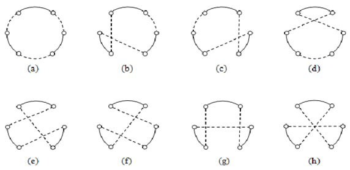

# L'euristica di Clarke e Wright
L'euristica di Clarke e Wright è un algoritmo utilizzato per risolvere il problema del routing dei veicoli (VRP). Questo algoritmo è particolarmente utile quando si cerca di minimizzare la distanza totale percorsa dai veicoli.
Ecco una descrizione passo-passo dell'euristica di Clarke e Wright:
1. Inizialmente, ogni nodo (o cliente) è servito da un veicolo separato. Quindi, se ci sono N nodi, ci sono N rotte, ognuna delle quali va dal deposito al nodo e ritorna al deposito.

2. Calcola le economie di fusione per ogni possibile coppia di rotte. L'economia di fusione è la differenza tra la distanza totale delle due rotte separate e la distanza totale se le due rotte fossero fuse in un'unica rotta. Le economie di fusione possono essere calcolate utilizzando la formula: `economia = distanza(deposito, nodo1) + distanza(deposito, nodo2) - distanza(nodo1, nodo2)`.

3. Ordina le economie di fusione in ordine decrescente.

4. Inizia a fondere le rotte a partire dalla coppia con l'economia di fusione più alta. Fonde le rotte solo se la fusione non viola le restrizioni del problema (ad esempio, la capacità del veicolo).

5. Ripeti il passaggio 4 fino a quando non è più possibile fondere ulteriori rotte.

L'euristica di Clarke e Wright è un algoritmo greedy, il che significa che prende la decisione ottimale ad ogni passaggio sperando che queste decisioni locali ottimali portino a una soluzione globale ottimale. Tuttavia, come con tutte le euristiche, non c'è garanzia che l'euristica di Clarke e Wright produca la soluzione ottimale al problema del VRP.

# L'euristica Sweep
L'algoritmo Sweep è un metodo euristico utilizzato per risolvere problemi di instradamento dei veicoli, 
come il problema del Veicolo con Capacità (Capacitated Vehicle Routing Problem, CVRP). 
Questo algoritmo è noto per la sua semplicità ed efficienza nella costruzione di soluzioni iniziali che possono essere ulteriormente migliorate tramite altre tecniche di ottimizzazione.

Passaggi dell'Algoritmo Sweep
Selezione di un Deposito:

Si inizia selezionando un punto di riferimento, solitamente il deposito da cui partono tutti i veicoli.
Conversione delle Coordinate Polari:

Le coordinate cartesiane dei clienti vengono convertite in coordinate polari rispetto al deposito. 
Questo comporta calcolare l'angolo (sweep angle) di ciascun cliente rispetto al deposito.
Ordinamento per Angolo:

I clienti vengono ordinati in base all'angolo polarizzato in senso orario (o antiorario) rispetto al deposito.
Formazione dei Tour:

Si inizia a formare i tour aggiungendo clienti ordinati in una lista finché la capacità del veicolo non viene raggiunta. 
Quando un veicolo è pieno, si inizia un nuovo tour con il veicolo successivo.
Ritorno al Deposito:

Ogni tour deve terminare ritornando al deposito. 
Questo passaggio garantisce che ogni veicolo parte e ritorna al deposito dopo aver servito i clienti assegnati.
Miglioramento della Soluzione (opzionale):

La soluzione ottenuta può essere ulteriormente migliorata mediante tecniche di ottimizzazione locale come il 2-opt, 3-opt, 
o altre strategie di ricerca locale.
Vantaggi e Limiti dell'Algoritmo Sweep
Vantaggi:

Semplicità: Facile da implementare e comprendere.
Velocità: Rapido nel fornire una soluzione iniziale.
Scalabilità: Può gestire un numero relativamente grande di clienti senza tempi di calcolo eccessivi.
Limiti:

Qualità della Soluzione: La soluzione ottenuta potrebbe non essere ottimale e può essere lontana dalla soluzione migliore possibile.
Dipendenza dalla Geometria: La performance può variare a seconda della distribuzione geografica dei clienti. 
Cluster di clienti possono influenzare negativamente la qualità della soluzione.
Miglioramento Necessario: Spesso richiede ulteriori passaggi di ottimizzazione per ottenere risultati competitivi.

# Ottimizzazione Locale

1. 2-opt 
    È un'euristica di ottimizzazione locale che cerca di migliorare una soluzione scambiando due archi di un percorso con l'obiettivo di ridurre la lunghezza totale del percorso. Ecco come funziona:
    
    Selezione degli Archi: Si selezionano due archi non adiacenti in un percorso.
    Scambio degli Archi: Si rimuovono questi archi e si ricollegano i nodi in modo alternato.
    Valutazione del Risultato: Si calcola la nuova distanza totale del percorso. Se la nuova distanza è minore di quella precedente, si accetta il nuovo percorso.
    Iterazione: Il processo viene ripetuto finché non si trova più nessun miglioramento.
    Esempio: Per un percorso
    A→B→C→D→E, si possono selezionare gli archi
    𝐵 → 𝐶 e 𝐷 → 𝐸 e scambiarli per ottenere 𝐴 → 𝐷 → 𝐶 → 𝐵 → 𝐸

2. 3-opt

    È un'estensione del 2-opt che coinvolge la rimozione di tre archi e la ricollegamento dei nodi in modo da esplorare un set più ampio di soluzioni possibili. Ecco come funziona:
    
    Selezione degli Archi: Si selezionano tre archi nel percorso.
    Rimozione degli Archi: Si rimuovono questi archi, creando tre segmenti di percorso.
    Ri-collegamento dei Segmenti: Si provano tutte le possibili combinazioni di ricollegamento dei segmenti.
    Valutazione del Risultato: Si calcola la nuova distanza totale per ogni combinazione. Se una combinazione riduce la distanza totale, si accetta il nuovo percorso.
    Iterazione: Il processo viene ripetuto finché non si trova più nessun miglioramento.
    Altri Metodi di Ottimizzazione
3. Simulated Annealing:

    Un algoritmo probabilistico che cerca di evitare i minimi locali permettendo, occasionalmente, peggioramenti temporanei nella soluzione.

4. Tabu Search: 

   Un metodo di ricerca locale che utilizza una lista di soluzioni tabu (vietate) per evitare di ritornare su soluzioni già esplorate, facilitando così l'esplorazione di nuove soluzioni.

5. Genetic Algorithms: 

    Algoritmi ispirati alla selezione naturale che utilizzano operazioni come la crossover e la mutazione per evolvere una popolazione di soluzioni verso un'ottimizzazione migliore.

6. Variable Neighborhood Search (VNS): 

    Un algoritmo che esplora sistematicamente diversi tipi di mosse (vicinati) per migliorare la soluzione corrente.

7. Large Neighborhood Search (LNS): 

    Simile al VNS, ma focalizzato su grandi cambiamenti nella soluzione corrente per esplorare nuovi spazi di soluzione.

8. 3-opt:
   